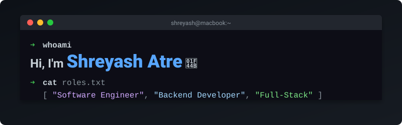

<div align="center">

<!-- ===== ANIMATED BANNER ===== -->
<picture>
  
</picture>

<br/>

<!-- ===== INTRODUCTION ===== -->

## Hey, I'm Shreyash 👋

**Computer Science student @ SPPU, Pune &nbsp;|&nbsp; Backend Developer &nbsp;|&nbsp; Full-Stack Engineer**

<p>
I build backend systems, practical software products, APIs, and full-stack applications — <br/>turning real-world requirements into reliable software.
</p>

<br/>

<!-- ===== LANYARD BADGE ===== -->


<br/>

---

<!-- ===== ABOUT ME ===== -->

### 🧑‍💻 About Me

</div>

```js
const shreyash = {
    location:   "Pune, India 🇮🇳",
    education:  "BSc Computer Science @ SPPU",
    roles:      ["Software Engineer", "Backend Developer", "Full-Stack Developer"],
    focus:      "Backend Engineering, API Architecture, Databases, Cloud Deployment",
    tagline:    "Build clearly. Understand deeply. Improve continuously.",
};
```

<div align="center">

---

<!-- ===== CURRENT FOCUS ===== -->

### 🎯 Current Focus

</div>

- 🏗️ **Building** — **Syantrex ERP**: a multi-tenant business management platform
- ⚙️ **Backend** — API architecture, Node.js, NestJS, REST APIs
- 🗄️ **Databases** — PostgreSQL database design and optimization
- ☁️ **Cloud & DevOps** — Cloud deployment and production systems
- 🌐 **Full-Stack** — Production applications with React, Next.js, and Flutter

<div align="center">

---

<!-- ===== TECH STACK ===== -->

### ⚙️ Tech Stack

#### Languages


#### Backend & Databases


#### Frontend


#### Cloud & Tools


---

<!-- ===== DEVELOPER CARDS ===== -->

### 📊 Developer Cards

<p>
  
  &nbsp;&nbsp;
  
</p>

<p>
  
</p>


---

<!-- ===== FEATURED PROJECTS ===== -->

### 🚀 Featured Projects & Experience

</div>

| Project | Description | Stack |
|---------|-------------|-------|
| 💼 [**Syantrex ERP**](https://www.syantrex.online) | Multi-tenant business management platform handling real-world retail workflows. Features role-based access control, inventory management, dynamic reporting, PDF invoicing, and a scalable production backend. | `NestJS` `PostgreSQL` `Prisma` `Flutter` `WebSockets` |
| 🩺 **DermaScanAI** | AI-assisted healthcare application combining computer vision with practical workflow features for image-based skin condition classification. *🥈 2nd Prize — SP College Science Exhibition 2026* | `Next.js` `FastAPI` `TensorFlow` `Keras` |
| 🌍 [**Generative Resilience Agent**](https://www.genresai.me/) | Climate-focused application providing agricultural insights using generative AI. *🏆 AWS ImpactX Challenge — IIT Bombay Techfest 2025* | `React` `Vite` `Gemini API` |
| 🏥 **Careasa Healthcare** | App Development Intern: Worked on backend architecture and application workflows. Developed REST APIs, implemented secure JWT authentication, and optimized database integrations. | `Node.js` `Express.js` `REST APIs` `JWT` |

<div align="center">

---

<!-- ===== CONTRIBUTION SNAKE ===== -->

### 🐍 Contribution Activity

<picture>
  <source media="(prefers-color-scheme: dark)" srcset="https://raw.githubusercontent.com/shreyash0216/shreyash0216/output/github-contribution-grid-snake-dark.svg">
  <source media="(prefers-color-scheme: light)" srcset="https://raw.githubusercontent.com/shreyash0216/shreyash0216/output/github-contribution-grid-snake.svg">
  
</picture>

<sub>Snake animation generated daily via GitHub Actions with <a href="https://github.com/Platane/snk">Platane/snk</a></sub>

---

<!-- ===== CONNECT ===== -->

### 🤝 Connect

[](https://shreyash0216.github.io/Shreyash_Portfolio/)
[](https://www.linkedin.com/in/shreyash-atre-901340317/)
[](mailto:shreyashatre16@gmail.com)
[](https://x.com/atre_shreyash)
[](https://github.com/shreyash0216)

---

<!-- ===== PROFILE VIEWS ===== -->


---

<br/>


<sub>⚡ <b>Build clearly. Understand deeply. Improve continuously.</b> ⚡</sub>

</div>
