<div align="center">
  <picture>
    
  </picture>

  ### Software Engineer | Backend Developer | Full-Stack Developer

  *I build backend systems, practical software products, APIs, and full-stack applications — turning real-world requirements into reliable software.*
</div>

---

## 👨‍💻 About Me

```js
const shreyash = {
    location: "Pune, India 🇮🇳",
    education: "BSc Computer Science @ SPPU",
    roles: [
        "Software Engineer",
        "Backend Developer",
        "Full-Stack Developer"
    ],
    focus: [
        "Backend Engineering",
        "API Architecture",
        "Databases",
        "Full-Stack Applications",
        "Cloud Deployment"
    ],
    currentlyBuilding: "Syantrex ERP",
    philosophy: "Build clearly. Understand deeply. Improve continuously."
};
```

---

## 🎯 Current Focus

* 🏗️ Building **Syantrex ERP**
* ⚙️ Backend engineering and API architecture
* 🗄️ PostgreSQL and database design
* ☁️ Cloud deployment and production systems
* 🌐 Full-stack application development
* 📚 Improving system design and software engineering fundamentals
* 💼 Open to **SDE Intern / SDE-1 / Backend / Full-Stack opportunities**

---

## 💻 Tech Stack

### Languages
<p align="left">
  
  
  
  
  
  
</p>

### Backend
<p align="left">
  
  
  
  
</p>

### Frontend
<p align="left">
  
  
  
  
</p>

### Databases
<p align="left">
  
  
  
</p>

### Cloud / DevOps
<p align="left">
  
  
  
  
  
</p>

---

## 🏗️ Featured Projects & Experience

### 💼 [Syantrex ERP](https://www.syantrex.online)
**Multi-Tenant Business Management Platform**

`NestJS • PostgreSQL • Prisma • Flutter • WebSockets`

A robust business management platform built for real-world retail workflows. Key functionality includes:
* Multi-tenant architecture for handling multiple independent businesses
* Role-based access control and employee attendance tracking
* Comprehensive sales and inventory management systems
* Interactive dashboards and dynamic reporting
* Automated PDF invoice generation
* Scalable production backend deployment and business workflow automation

---

### 🩺 DermaScanAI
**AI-powered skin disease detection platform**  

`Next.js • FastAPI • TensorFlow/Keras`

An AI-assisted healthcare application combining computer vision with practical workflow features.
* Image-based skin condition classification using trained models
* Seamless frontend and backend integration for AI prediction workflows
* Practical healthcare-oriented application design

**🥈 2nd Prize — SP College Science Exhibition 2026**

---

### 🌍 [GRA — Generative Resilience Agent](https://www.genresai.me/)
**AWS ImpactX Challenge — IIT Bombay Techfest 2025**

`React • Vite • Gemini API`

Contributed to a climate-focused application providing agricultural insights using generative AI.
* Frontend development and React UI improvements
* Integration with the existing AI functionality
* Refined application workflow and user experience improvements

---

### 🏥 Careasa Healthcare
**App Development Intern**

Worked on backend architecture and application workflows for a healthcare platform.
* Developed REST APIs using Node.js and Express.js
* Implemented secure JWT-based authentication
* Designed and optimized database integrations
* Handled production application development and backend workflows

---

## ⚙️ Engineering Interests

* Backend Architecture
* REST API Design
* Database Design
* Authentication & Authorization
* Distributed Systems
* Cloud Infrastructure
* System Design
* Full-Stack Engineering
* Production Software

---

## 📊 GitHub Statistics

<div align="center">
  <picture>
    <source media="(prefers-color-scheme: dark)" srcset="https://github-profile-summary-cards.vercel.app/api/cards/profile-details?username=shreyash0216&theme=github_dark">
    <source media="(prefers-color-scheme: light)" srcset="https://github-profile-summary-cards.vercel.app/api/cards/profile-details?username=shreyash0216&theme=default">
    
  </picture>
  
  <br/>
  
  <!-- Add GitHub contribution snake using dynamic Action generation if enabled -->
  <picture>
    <source media="(prefers-color-scheme: dark)" srcset="https://raw.githubusercontent.com/shreyash0216/shreyash0216/output/github-contribution-grid-snake-dark.svg">
    <source media="(prefers-color-scheme: light)" srcset="https://raw.githubusercontent.com/shreyash0216/shreyash0216/output/github-contribution-grid-snake.svg">
    
  </picture>
</div>

---

## 🏆 Certifications & Achievements

* 📜 **IBM SkillsBuild × AICTE** — AI Automation & Intelligent Solutions
* 📜 **IBM SkillsBuild** — Gen AI & Cloud Computing
* 🥈 **2nd Prize** — SP College Science Exhibition 2026
* 🏆 **AWS ImpactX Challenge** — IIT Bombay Techfest 2025
* 🧠 **SPPU Inter-College CS Quiz** — Top 9
* 📜 **Oracle Cloud Infrastructure** — Generative AI Professional
* 📜 **Scaler** — Fundamentals of Docker & Kubernetes

---

## 🤝 What I'm Looking For

> Currently open to software engineering opportunities where I can work on backend systems, APIs, databases, cloud infrastructure, and full-stack applications.

**SDE Intern • Backend Developer • Full-Stack Developer • SDE-1**

---

## 🌐 Connect

<div align="center">

[](https://shreyash0216.github.io/Shreyash_Portfolio/)
[](https://www.linkedin.com/in/shreyash-atre-901340317/)
[](mailto:shreyashatre16@gmail.com)
[](https://x.com/atre_shreyash)
[](https://github.com/shreyash0216)

</div>
